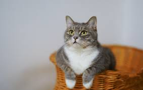
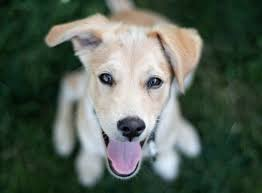
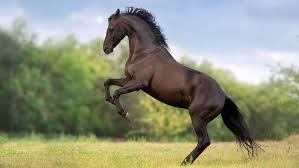
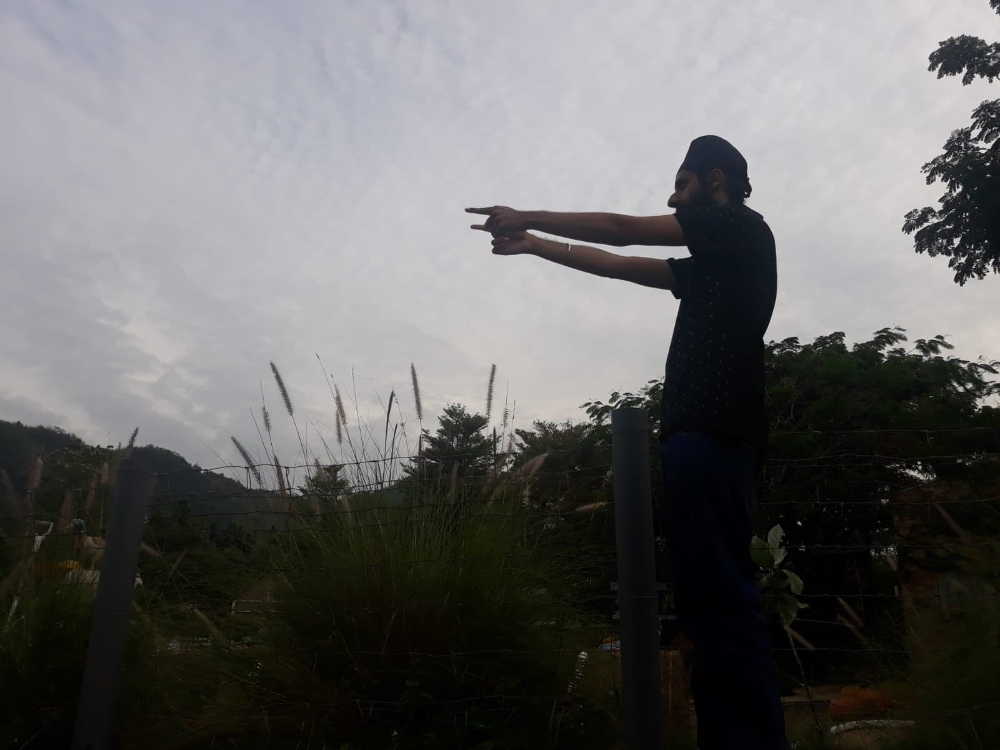

# Image-Classification-Using-Keras

## Image classification algorithms, powered by Deep Learning (DL) Convolutional Neural Networks  (CNN), fuel many advanced technologies and are a core research subject for many industries ranging from transportation to healthcare.

## If you want to train a deep learning algorithm for image classification, you need to understand the different networks and algorithms available to you and decide which of them better is right for your needs.

## The Use of Convolutional Neural Networks for Image Classification
The CNN approach is based on the idea that the model function properly based on a local understanding of the image. It uses fewer parameters compared to a fully connected network by reusing the same parameter numerous times. While a fully connected network generates weights from each pixel on the image, a convolutional neural network generates just enough weights to scan a small area of the image at any given time.

This approach is beneficial for the training process━the fewer parameters within the network, the better it performs. Additionally, since the model requires less amount of data, it is also able to train faster.

When a CNN model is trained to classify an image, it searches for the features at their base level. For example, while a human might identify an elephant by its large ears or trunk, a computer will scan for curvatures of the boundaries of these features. Some object detection networks like YOLO achieve this by generating bounding boxes, which predict the presence and class of objects within the bounding boxes. Instance segmentation , a subset of image segmentation , takes this a step further and draws boundaries for each object, identifying its shape.

There are many applications for image classification with deep neural networks. CNNs can be embedded in the systems of autonomous cars to help the system recognize the surrounding of the car and classify objects to distinguish between ones that do not require any action, such as trees on the side of the road, and ones that do, such as civilians crossing the street.

Another use for CNNs is in advertising. For example, CNNs can easily scan a person’s Facebook page, classify fashion-related images and detect the person’s preferred style, allowing marketers to offer more relevant clothing advertisements. With a deep enough network, this principle can also be applied to identifying locations, such as pubs or malls, and hobbies like football or dancing.

DataSets:
Training

https://drive.google.com/open?id=1m1R6NYAMN4PsvPcvCO0T44l3RFDDPkuv

Validation

https://drive.google.com/open?id=1HWIkgrK6JhBLZR-iMkiTnakxoDfuDE-O

Datasets:

https://www.kaggle.com/sanikamal/horses-or-humans-dataset

https://www.kaggle.com/tongpython/cat-and-dog

# Image classification for  4 classes :

##   cat

  

#

## dog

  

  
#

## horse

  

  
  #

## human

  

#

#Libraries Needed to install

keras==2.0.0

tensorflow==1.14.0

opencv-python

# My project accuracy is not bad this is just the concept on how to implement keras with cnn network do do image classification
## improvement can be done by changing the learning rate or do regularization method  which will be explained in the next few lines

#                       Steps to train the model

#   data preprocessing:

from keras.preprocessing.image import ImageDataGenerator

train_datagen = ImageDataGenerator(rescale = 1./255,
                                   shear_range = 0.2,
                                   zoom_range = 0.2,
                                   horizontal_flip = True)

test_datagen = ImageDataGenerator(rescale = 1./255)

training_set = train_datagen.flow_from_directory('training',
                                                 target_size = (64, 64),
                                                 batch_size = 32,
                                                 class_mode = 'sparse')

test_set = test_datagen.flow_from_directory('validation',
                                            target_size = (64, 64),
                                            batch_size = 32,
                                            class_mode = 'sparse')
                                            
## this part is basically used to normalize and make the data better by preprocvessing using keras.processing by generating the image by using data augmentation by rescaling zoom shear and film to increase the size of the data set during training

# creating a sequential model:

from keras.models import Sequential
from keras.layers import Convolution2D
from keras.layers import MaxPooling2D
from keras.layers import Flatten
from keras.layers import Dense, Dropout

classifier = Sequential()

## Step 1 - Convolution
classifier.add(Convolution2D(32, 3, 3, input_shape = (64, 64, 3), activation = 'relu'))

## Step 2 - Pooling
classifier.add(MaxPooling2D(pool_size = (2, 2)))

## Adding a second convolutional layer
classifier.add(Convolution2D(32, 3, 3, activation = 'relu'))
classifier.add(MaxPooling2D(pool_size = (2, 2)))
## extra convulutional layer
## classifier.add(Convolution2D(32,3,3,activation='relu'))
## classifier.add(MaxPooling2D(pool_size = (2, 2)))

## Step 3 - Flattening
classifier.add(Flatten())

## Step 4 - Full connection
classifier.add(Dense(400,activation = 'relu'))# 128,relu
classifier.add(Dropout(0.3))
classifier.add(Dense(400,activation = 'relu'))# 128,relu
classifier.add(Dropout(0.2))
classifier.add(Dense(4,activation = 'softmax'))#4,sigmoid

